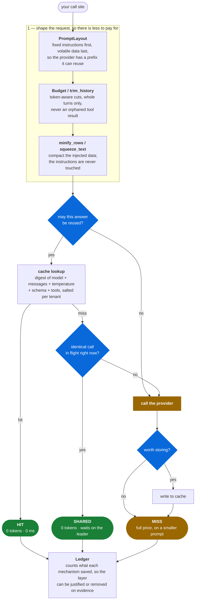

# tokentuner

Cut tokens, cost and latency on LLM calls without changing what the model is asked.

Standalone, stdlib-only, provider-agnostic. It sits *below* whatever decides which
model to call and *above* the SDK that calls it.

```
your app  ->  your routing/tiering layer  ->  tokentuner  ->  openai / openrouter / anything
```

## How a call flows through it

Two phases, in this order: make the request smaller, then try not to send it at
all. The order matters — the cheapest possible outcome is always checked first.



**`may this answer be reused?`** is `no` when the temperature is above
`cache_max_temperature`, when the call carries tools, when it streams, or when
the task opted out. **`worth storing?`** is `no` when the call failed, when the
response is oversized, or when the prompt carried personal data and the store is
persistent without `cache_persist_sensitive`. Both are expanded under
[What it refuses to cache](#what-it-refuses-to-cache).

| Outcome | Provider call | Tokens billed | When |
|---|---|---|---|
| **HIT** | none | zero | the same call was answered before and is still within its TTL |
| **SHARED** | none | zero | an identical call was already in flight; this caller waits on it |
| **MISS** | one | full, on a shaped prompt | genuinely new work |

A hit is **never** reported as a model call. Mixing calls that never happened
into escalation rates, failure rates and latency percentiles corrupts the very
numbers you would use to decide what to tune next, so savings are counted in the
ledger instead.

## What it does

| Component | Problem it solves |
|---|---|
| `PromptLayout` | Providers discount input tokens that repeat the *start* of a request. Prompts written naturally put the volatile document first, so the discount never applies. Reorders static-before-volatile and marks the prefix for models that need an explicit marker. |
| `ResponseCache` | The same call, made twice, paid for twice. Content-addressed, tenant-scoped, TTL'd, with refusals that matter more than the hits (see below). |
| `SingleFlight` | N identical calls *in flight at once* all miss the cache, because none has returned yet. Collapses them into one. |
| `Budget` / `trim_history` | Token-aware trimming per section, instead of one magic number in a slice expression. Drops whole conversation turns, never half of one, and never orphans a tool result. |
| `minify_rows` / `squeeze_text` | Pretty-printed JSON spends a large share of its tokens on whitespace and quoting. Compacts injected data without touching the instructions. |
| `EmbeddingBatcher` | De-duplicates by content hash before batching. Re-embedding unchanged text is the most common avoidable spend in any system that embeds. |
| `split_results` | Batch one prompt over N items to pay the shared prefix once. Matches results to inputs by an echoed index, never by position. |
| `Ledger` | Counts what each of the above actually saved, so the layer can be justified or removed on evidence. |
| `report.analyze` | Reads usage rows and ranks what to fix: mis-tiered tasks, prompt-heavy tasks, missing output caps, failing tasks, cost concentration. |

## Install

```bash
# Pinned to a tag, so an upgrade is always a deliberate edit:
pip install "tokentuner @ git+https://github.com/jigarmistry/tokentuner.git@v0.1.0"

# With the optional extras:
pip install "tokentuner[all] @ git+https://github.com/jigarmistry/tokentuner.git@v0.1.0"
```

Not on PyPI yet — install from the tag above, or vendor the `tokentuner/`
directory, which works just as well since there is nothing to resolve.

Zero required dependencies. `tiktoken` gives exact token counts; without it the
built-in estimator is used, which deliberately over-counts so budgets under-fill
rather than overflow. Cache backends: memory (default), SQLite, Mongo, Redis.

## Use

```python
from tokentuner import default_tuner, PromptLayout

layout = PromptLayout(model=model_id, task="classify.document")
layout.static("system", INSTRUCTIONS)        # identical every call
layout.volatile("user", document_text)       # differs every call

result, meta = default_tuner().run(
    lambda: client.chat.completions.create(model=model_id, messages=layout.messages()),
    task="classify.document",
    model=model_id,
    messages=layout.messages(),
    temperature=0.2,
    tenant=tenant_id,          # scopes the cache key; required for multi-tenant
    sensitive=True,            # prompt may carry personal data
    to_entry=lambda r: {...},  # what to store, or None to refuse
    from_entry=lambda e: ...,  # how to rebuild a result from a stored entry
)

meta.cache      # "hit" | "miss" | "skip"
meta.deduped    # True when this caller piggybacked on an identical in-flight call
```

`to_entry` / `from_entry` are why this package needs no adapter per project: it
never inspects the value it caches, so it does not care what result class you use.

**The one rule:** whatever your runner returns on a miss, `from_entry` must
return the same type on a hit. Callers cannot tell the two apart, so a runner
that returns a raw SDK response while `from_entry` returns a string works fine
until the cache warms up, then breaks everywhere at once. Have the runner return
a small result type of your own rather than the provider's object.

A complete, runnable integration is in [`examples/openai_basic.py`](examples/openai_basic.py):

```bash
PYTHONPATH=. python examples/openai_basic.py
```

## Adding it to an existing project

1. `pip install tokentuner` (or vendor the directory — it has no dependencies).
2. Build one `Tuner` at startup from your settings — this is your adapter, and
   it is the only file that knows about your project. Forty lines is typical.
3. At each call site: build messages with `PromptLayout`, wrap the provider call
   in `tuner.run(...)`.
4. Mark tasks that must never be cached (`cacheable=False`) — anything where
   regenerating is a feature, and anything whose answer depends on live state.
5. Once traffic accumulates, run the analyzer against your usage rows.

Steps 1–2 are one-off. Step 3 is per call site and can be done incrementally:
an unwrapped call site keeps working exactly as before.

## What it refuses to cache

The refusals are the design. A cache that stores everything is easy to write and
returns wrong answers that look right.

- **Temperature above `cache_max_temperature`** (default 0.35). The caller asked
  for variety; serving a previous answer removes it invisibly.
- **Tool-calling turns.** They depend on state the key cannot see, so a hit
  serves yesterday's data.
- **Streaming.** The first token is gone before the last can be judged.
- **Failed or refused answers.** `to_entry` returning `None` means "do not store".
- **Personal data in a persistent store**, unless `cache_persist_sensitive=True`.
  A cache entry is a second copy of that data in a place nobody wrote a
  retention policy for.
- **Cross-tenant reuse**, always. Keys are salted per tenant; a shared hit
  between customers is a data leak that looks like a cache hit.

Keys are digests, never prompts — they end up in logs and metric labels.

## Configuration

Read from the environment (`TOKENTUNER_*`) or installed by the host:

```python
from tokentuner import TunerConfig, Tuner, set_default_tuner
set_default_tuner(Tuner(config=TunerConfig(cache_ttl_seconds=1800, cache_store="mongo")))
```

`enabled=False` turns every optimisation into a pass-through — reachable from
config so "is it the cache?" is answerable in a restart rather than a deploy.

## Analyzer

```bash
# from a checkout, without installing:
PYTHONPATH=. python -m tokentuner --json usage.json --format json
# installed, the console script is on PATH:
tokentuner --mongo-uri "$MONGO_URL" --database myapp --days 30
```

Expects rows with `task, model, tier, tokens_in, tokens_out, cost_usd,
latency_ms, escalated, ok, created_at`. Findings below 20 samples are suppressed:
a rate computed from five calls is noise.

## Tests

```bash
python tests/test_tokentuner.py
```

No pytest, no network, no database.
